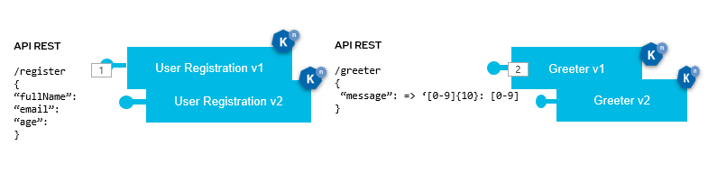
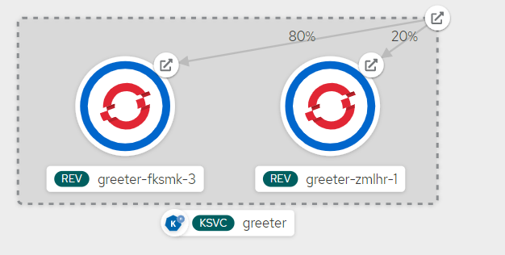
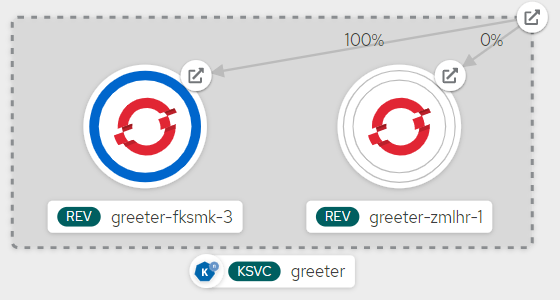
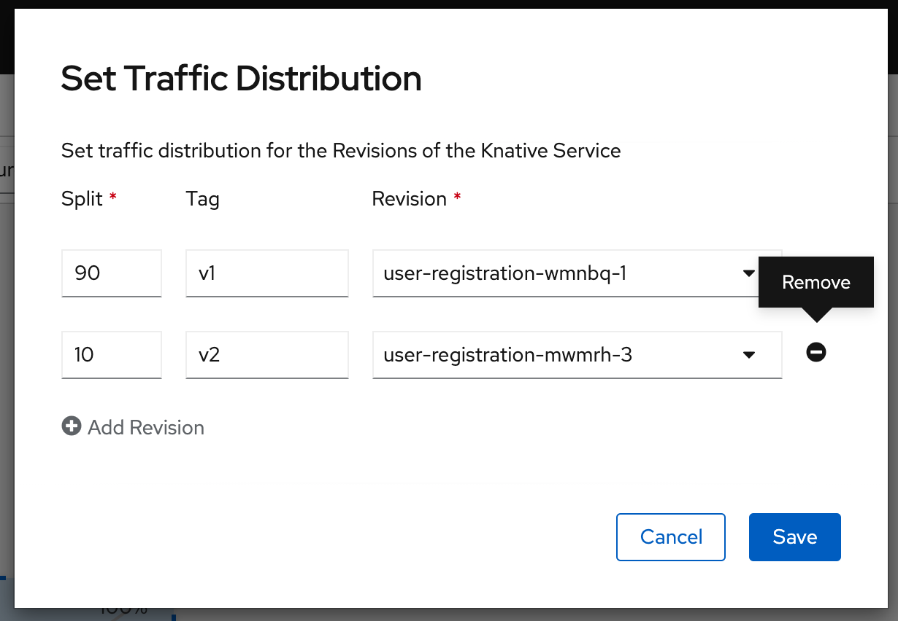
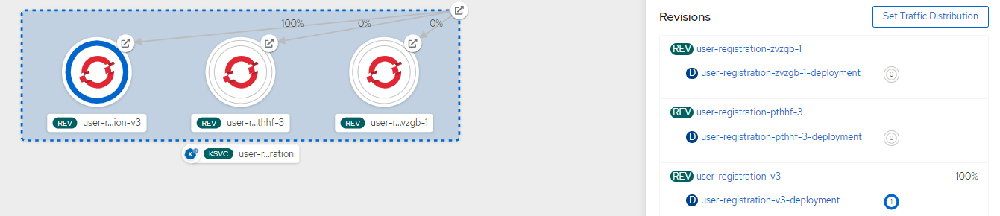
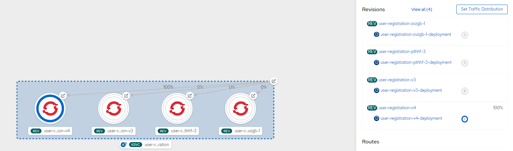

## Knative user-registration

This repository holds source code for a demonstration of Knativce Serverless capabilities on OpenShift. It demonstrates basic features of Knative Serving and Eventing modules.

Here's the architecture of the application we're going to deploy and managed with Knative:

> This Project is inspired by the work of [Laurent Broudoux](https://github.com/lbroudoux/knative-user-registration), many Thanks for the presentation.



The application is made of following components:
* A `user-registration` microservice that is presenting a REST API for registering new users into a system,
* A `greeter` microservice that is presenting a REST API for retrieving a message from API.

In the demonstration scenario, we are going to deploy differents revisions of the `user-registration` and `greeter` service to illustrate traffic distribution and canary release using Knative.


### Prerequisites

So you should have an OpenShift 4.6+ cluster (or a Kubernetes one but it's trickier to setup) with the different features enabled:

> If using OpenShift 4.5, be sure to install the OpenShift Serverless Operator using the latest `4.6` channel. Otherwise the CRD installed into the cluster won't have the correct API versions.

> If you don't have cli on your machine please go to those urls : 
    <br>
      ` oc : ` [oc-cli](https://mirror.openshift.com/pub/openshift-v4/clients/oc/4.5/)
    <br>
      ` kn : ` [kn-cli](https://github.com/knative/client/releases/tag/v0.16.1)

> Install Openshift Serverless : [Documentation OCP 4.5](https://docs.openshift.com/container-platform/4.5/serverless/installing_serverless/installing-openshift-serverless.html)

You should also have the `kn` CLI tool available on your laptop or bastion server:

```sh
$ kn version
Version:      v0.16.1
Build Date:   2020-09-25 05:50:36
Git Revision: f895973
Supported APIs:
* Serving
  - serving.knative.dev/v1 (knative-serving v0.16.0)
* Eventing
  - sources.knative.dev/v1alpha2 (knative-eventing v0.16.0)
  - eventing.knative.dev/v1beta1 (knative-eventing v0.16.0)
```

Start creating the new project to host our components :

```sh
oc new-project user-registration-serverless
```

### Demonstration

#### Knative Serving

Deploy version `v1` of the `greeter`:

```
 $ kn service create -f greeter-v1.yml
 Creating service 'greeter' in namespace 'user-registration-serverless':

  0.102s The Configuration is still working to reflect the latest desired specification.
  0.358s The Route is still working to reflect the latest desired specification.
  2.868s Configuration "greeter" is waiting for a Revision to become ready.
 24.085s ...
 24.537s Ingress has not yet been reconciled.
 24.937s unsuccessfully observed a new generation
 25.898s Ready to serve.

Service 'greeter' created to latest revision 'greeter-zmlhr-1' is available at URL:
http://greeter-user-registration-serverless.apps.cluster-091d.091d.example.opentlc.com
$ kn revision list -n user-registration-serverless
NAME              SERVICE   TRAFFIC   TAGS   GENERATION   AGE     CONDITIONS   READY   REASON
greeter-zmlhr-1   greeter   100%             1            2m22s   3 OK / 4     True

$ kn service update greeter --tag greeter-zmlhr-1=v1 -n user-registration-serverless
Updating Service 'greeter' in namespace 'user-registration-serverless':

  0.067s The Route is still working to reflect the latest desired specification.
  0.269s Ingress has not yet been reconciled.
  0.793s unsuccessfully observed a new generation
  1.094s Ready to serve.

Service 'greeter' with latest revision 'greeter-zmlhr-1' (unchanged) is available at URL:
http://greeter-user-registration-serverless.apps.cluster-091d.091d.example.opentlc.com

$ export GREETER_URL=`kn service describe greeter -o json -n user-registration-serverless | jq -r '.status.url'`
```

Play with App through CURL command, get greet message and see the Pods scaling-up and down:

```sh
$ while true; do curl $GREETER_URL; sleep .5; done;
Version: v1  greeter => '9861675f8845' : 1
Version: v1  greeter => '9861675f8845' : 2
Version: v1  greeter => '9861675f8845' : 3
Version: v1  greeter => '9861675f8845' : 4
Version: v1  greeter => '9861675f8845' : 5
```
Deploy version `v2` of the `greeter`:

```
 $ kn service update greeter --env MESSAGE_PREFIX="Version: v2" -n user-registration-serverless
 Updating Service 'greeter' in namespace 'user-registration-serverless':

  0.182s The Configuration is still working to reflect the latest desired specification.
 13.599s Traffic is not yet migrated to the latest revision.
 13.948s Ingress has not yet been reconciled.
 14.121s unsuccessfully observed a new generation
 14.874s Ready to serve.

Service 'greeter' updated to latest revision 'greeter-fksmk-3' is available at URL:
http://greeter-user-registration-serverless.apps.cluster-091d.091d.example.opentlc.com

$ kn revision list -n user-registration-serverless
NAME              SERVICE   TRAFFIC   TAGS   GENERATION   AGE   CONDITIONS   READY   REASON
greeter-fksmk-3   greeter   100%             2            80s   4 OK / 4     True
greeter-zmlhr-1   greeter             v1     1            21m   3 OK / 4     True

$ kn service update greeter --tag greeter-fksmk-3=v2 -n user-registration-serverless
Updating Service 'greeter' in namespace 'user-registration-serverless':

  0.382s The Route is still working to reflect the latest desired specification.
  0.621s Ingress has not yet been reconciled.
  0.921s unsuccessfully observed a new generation
  1.791s Ready to serve.

Service 'greeter' with latest revision 'greeter-fksmk-3' (unchanged) is available at URL:
http://greeter-user-registration-serverless.apps.cluster-091d.091d.example.opentlc.com

$ export GREETER_URL=`kn service describe greeter -o json -n user-registration-serverless | jq -r '.status.url'`
```
Play with App through CURL command, get greet message and see the Pods scaling-up and down:

```sh
$ while true; do curl $GREETER_URL; sleep .5; done;
Version: v2  greeter => '9861675f8845' : 1
Version: v2  greeter => '9861675f8845' : 2
Version: v2  greeter => '9861675f8845' : 3
Version: v2  greeter => '9861675f8845' : 4
Version: v2  greeter => '9861675f8845' : 5
```
Handle traffic between version `v1` and  version `v2` of the `greeter` service:

### 1. Canary Deployment : 
```
 $ kn service update greeter --traffic v1=20,v2=80 -n user-registration-serverless
 Updating Service 'greeter' in namespace 'user-registration-serverless':

  0.451s The Route is still working to reflect the latest desired specification.
  1.385s Ingress has not yet been reconciled.
  2.794s unsuccessfully observed a new generation
  3.499s Ready to serve.

Service 'greeter' with latest revision 'greeter-fksmk-3' (unchanged) is available at URL:
http://greeter-user-registration-serverless.apps.cluster-091d.091d.example.opentlc.com

$ export GREETER_URL=`kn service describe greeter -o json -n user-registration-serverless | jq -r '.status.url'`
```

```sh
$ while true; do curl $GREETER_URL; sleep .5; done;
Version: v2  greeter => '9861675f8845' : 1
Version: v2  greeter => '9861675f8845' : 2
Version: v2  greeter => '9861675f8845' : 3
Version: v1  greeter => '9861675f8845' : 1
Version: v1  greeter => '9861675f8845' : 2
Version: v2  greeter => '9861675f8845' : 4
Version: v2  greeter => '9861675f8845' : 5
Version: v2  greeter => '9861675f8845' : 6
Version: v1  greeter => '9861675f8845' : 3
Version: v2  greeter => '9861675f8845' : 7
Version: v2  greeter => '9861675f8845' : 8
Version: v1  greeter => '9861675f8845' : 4
Version: v2  greeter => '9861675f8845' : 9
Version: v1  greeter => '9861675f8845' : 5
Version: v1  greeter => '9861675f8845' : 6
Version: v2  greeter => '9861675f8845' : 10
Version: v2  greeter => '9861675f8845' : 11
```

### 2. Blue Green Deployment : 
```
 $ kn service update greeter --traffic v1=0,v2=100 -n user-registration-serverless
Updating Service 'greeter' in namespace 'user-registration-serverless':

  0.069s The Route is still working to reflect the latest desired specification.
  0.248s Ingress has not yet been reconciled.
  0.456s unsuccessfully observed a new generation
  0.773s Ready to serve.

Service 'greeter' with latest revision 'greeter-fksmk-3' (unchanged) is available at URL:
http://greeter-user-registration-serverless.apps.cluster-091d.091d.example.opentlc.com

$ export GREETER_URL=`kn service describe greeter -o json -n user-registration-serverless | jq -r '.status.url'`
```

```sh
$  while true; do curl $GREETER_URL; sleep .5; done;
Version: v2  greeter => '9861675f8845' : 1
Version: v2  greeter => '9861675f8845' : 2
Version: v2  greeter => '9861675f8845' : 3
Version: v2  greeter => '9861675f8845' : 4
Version: v2  greeter => '9861675f8845' : 5
Version: v2  greeter => '9861675f8845' : 6
Version: v2  greeter => '9861675f8845' : 7
Version: v2  greeter => '9861675f8845' : 8
Version: v2  greeter => '9861675f8845' : 9
```


Deploy version `v1` of the `user-registration`:

```
$ kn service create -f  user-registration-v1.yml -n user-registration-serverless
Creating service 'user-registration' in namespace 'user-registration-serverless':

  0.106s The Configuration is still working to reflect the latest desired specification.
  0.217s The Route is still working to reflect the latest desired specification.
  0.307s Configuration "user-registration" is waiting for a Revision to become ready.
 26.103s ...
 26.290s Ingress has not yet been reconciled.
 26.526s unsuccessfully observed a new generation
 26.704s Ready to serve.

Service 'user-registration' created to latest revision 'user-registration-zvzgb-1' is available at URL:
http://user-registration-user-registration-serverless.apps.cluster-091d.091d.example.opentlc.com

$ kn service update user-registration --tag user-registration-zvzgb-1=v1 -n user-registration-serverless
Updating Service 'user-registration' in namespace 'user-registration-serverless':

  0.070s The Route is still working to reflect the latest desired specification.
  0.379s Ingress has not yet been reconciled.
  0.527s Ready to serve.

Service 'user-registration' with latest revision 'user-registration-zvzgb-1' (unchanged) is available at URL:
http://user-registration-user-registration-serverless.apps.cluster-091d.091d.example.opentlc.com

$ export APP_URL=`kn service describe user-registration -o json -n user-registration-serverless | jq -r '.status.url'`
```

Play with App through CURL command, registering new users and see the Pods scaling-up and down:

```sh
$  curl -XPOST $APP_URL/register -H 'Content-type: application/json' -d '{"fullName":"Maitre Yoda","email":"maitre.yoda@gmail.com","age":100}' -s | jq .
{
  "age": 100,
  "email": "maitre.yoda@gmail.com",
  "fullName": "Maitre Yoda",
  "id": "24f1a061-17bd-47c4-ab7e-bbf48c281453"
}
```

We've got `v1` responses so far with just 4 properties in the response. Deploy version `v2` that adds a new property and send events to Kafka. Do not put traffic on this new revision.

```sh
$ kn service update user-registration --image quay.io/microcks/quarkus-user-registration:latest --traffic @latest=0 --traffic v1=100 -n user-registration-serverless
Updating Service 'user-registration' in namespace 'user-registration-serverless':

  0.508s The Configuration is still working to reflect the latest desired specification.
  0.745s ...
  0.818s The Route is still working to reflect the latest desired specification.
 19.670s Ready to serve.

Service 'user-registration' updated to latest revision 'user-registration-pthhf-3' is available at URL:
http://user-registration-user-registration-serverless.apps.cluster-091d.091d.example.opentlc.com
```

From here, we want to split traffic between the 2 revisions to do a canary release. You can do that through:

the OpenShift console UI, tagging the new revision with `v2` (see below image),



or through the command line (see below commands):

``` sh
$ kn service update user-registration --tag user-registration-pthhf-3=v2 -n user-registration-serverless
$ kn service update user-registration --traffic v2=10,v1=90 -n user-registration-serverless
```

You can retrieve the specific `v2` url and check everything is fine:

```sh
$ export APP_V2_URL=`oc get ksvc user-registration -o json -n user-registration-serverless | jq -r '.status.traffic[1].url'`

$ curl -XPOST $APP_V2_URL/register -H 'Content-type: application/json' -d '{"fullName":"Maitre Yoda","email":"maitre.yoda@gmail.com","age":100}' -s | jq .
{
  "age": 100,
  "email": "maitre.yoda@gmail.com",
  "fullName": "Maitre Yoda",
  "id": "c637a5f8-ecfe-45be-b44d-69bf08043603"
}
```

Now that you're happy, move traffic from `v1` to `v2`

```sh
$ curl -XPOST $APP_URL/register -H 'Content-type: application/json' -d '{"fullName":"Maitre Yoda","email":"maitre.yoda@gmail.com","age":100}' -s | jq .
{
  "age": 100,
  "email": "maitre.yoda@gmail.com",
  "fullName": "Maitre Yoda",
  "id": "c637a5f8-ecfe-45be-b44d-69bf08043603"
}

$ kn service update user-registration --traffic v1=0,v2=100 -n user-registration-serverless
Updating Service 'user-registration' in namespace 'user-registration-serverless':

  0.114s The Route is still working to reflect the latest desired specification.
  0.246s Ingress has not yet been reconciled.
  0.325s unsuccessfully observed a new generation
  0.731s Ready to serve.

Service 'user-registration' with latest revision 'user-registration-pthhf-3' (unchanged) is available at URL:
http://user-registration-user-registration-serverless.apps.cluster-091d.091d.example.opentlc.com

$ curl -XPOST $APP_URL/register -H 'Content-type: application/json' -d '{"fullName":"Maitre Yoda","email":"maitre.yoda@gmail.com","age":100}' -s | jq .
{
  "age": 100,
  "email": "maitre.yoda@gmail.com",
  "fullName": "Maitre Yoda",
  "id": "c637a5f8-ecfe-45be-b44d-69bf08043603"
}
```
### 1. Handle spike traffic :
 > You will need to configure annotation target value `autoscaling.knative.dev/target: "10"`, by default a service can handle 100 request in parrallel
```
 $ oc apply -f user-registration-spike.yml -n user-registration-serverless
 $ kn service update user-registration --tag user-registration-v3=v3 -n user-registration-serverless
 $ kn service update user-registration --traffic v1=0,v2=0,v3=100 -n user-registration-serverless
```


### 1. Handle Cold start :
 > You will need to configure annotations value like this : 
    <br> - The minimum number of pods to scale down to : 
    `
          autoscaling.knative.dev/minScale: "2" 
    `
    <br>- The maximum number of pods to scale up to : 
    ` autoscaling.knative.dev/maxScale: "5"
    `
    <br> - Target 10 in-flight-requests per pod : 
    ` autoscaling.knative.dev/target: "10"
    `
```
 $ oc apply -f user-registration-cold-start.yml -n user-registration-serverless
 $ kn service update user-registration --tag user-registration-v4=v4 -n user-registration-serverless
 $ kn service update user-registration --traffic v1=0,v2=0,v3=0,v4=100 -n user-registration-serverless
```

